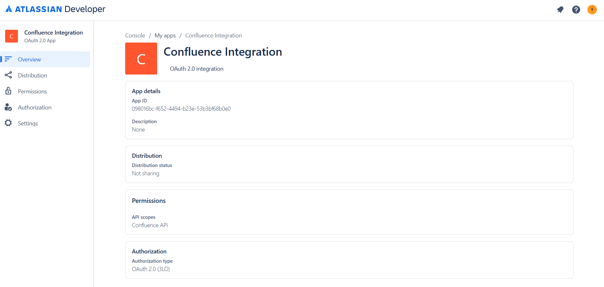

# Confluence Integration

This project integrates with Atlassian Confluence using OAuth2 authentication. It provides endpoints to list pages in a Confluence space and retrieve details of a specific page.

## Features

- **OAuth2 Authentication**: Authenticate with Confluence using client credentials.
- **List Pages**: Retrieve a list of pages in a specified Confluence space.
- **Page Details**: Fetch detailed information about a specific Confluence page.

## Prerequisites

1. **Node.js and npm**: Ensure you have npm and Node.js (version 18 or higher) installed.
    ```bash
    npm -v
    node -v
    ```

2. **Confluence API Credentials**:
   - `CLIENT_ID` and `CLIENT_SECRET` from your Atlassian developer account.
   - `CONFLUENCE_BASE_URL` for your Confluence instance.

## Installation

1. Clone the repository:
   ```bash
   git clone https://github.com/yael84324/Confluence-Integration.git
   cd Confluence-Integration
   ```

2. Install dependencies:
   ```bash
   npm install
   ```

3. Configure environment variables:
   - Create a `.env` file in the root directory.
   - Add the following variables:
     ```
     CLIENT_ID=<your-client-id>
     CLIENT_SECRET=<your-client-secret>
     CONFLUENCE_BASE_URL=<your-confluence-base-url>
     REDIRECT_URI=http://localhost:3000/auth/callback
     AUTH_URL=http://localhost:3000/auth
     PORT=3000
     ```

## Usage

1. **Start the server**:
   ```bash
   npm run auth-server
   ```

2. **Authenticate with Confluence**:
   - Visit `http://localhost:3000/auth` in your browser.
   - Complete the authentication process.

3. **List Pages in a Space**:
   - Use the `/pages/:spaceId` endpoint to retrieve a list of pages in a space.
   - Example:
     ```
     GET http://localhost:3000/pages/AB
     ```

4. **Get Page Details**:
   - Use the `/page/:pageId` endpoint to retrieve details of a specific page.
   - Example:
     ```
     GET http://localhost:3000/page/123
     ```

## API Endpoints

`/auth`
Redirects the user to the Confluence authentication page.

`/auth/callback`
Handles the callback after authentication and saves the tokens.

`/pages/:spaceId`
Returns a list of pages in the specified Confluence space.

`/page/:pageId`
Returns the details of a specific Confluence page.

## Testing

Run the test suite using Mocha:
```bash
npm run test
```

## Atlassian app configuration
